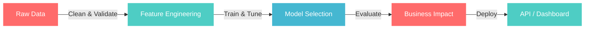

<div align="center">

<a href="https://git.io/typing-svg"></a>

<br>

[](https://linkedin.com/in/)
[](https://github.com/Jack-Fernandes781)
[](mailto:)

</div>

<br>


## About Me

I build ML systems that solve operational problems — predicting equipment failures, forecasting hospital resource needs, and pulling insights out of data that others overlook.

My focus areas:

- **Predictive Analytics** — forecasting failures and outcomes before they cost money
- **Classification Systems** — multi-class models with real business impact
- **Data Storytelling** — making complex findings accessible to stakeholders
- **Healthcare & Operations Analytics** — turning large datasets into actionable decisions

<br clear="right"/>

---

## Toolbox

<div align="center">


<br><br>


</div>

---

## Featured Work

<div align="center">

<a href="https://github.com/Jack-Fernandes781/fleet-predictive-maintenance">

</a>

</div>

<details>
<summary><b>Predicts vehicle component failures 30 days out — click to expand</b></summary>
<br>

An end-to-end ML pipeline that ingests telematics data and predicts **engine**, **brake**, and **battery** failures before they strand a truck on the highway.

| What | Detail |
|------|--------|
| **Best Model** | Gradient Boosting — ~84% accuracy |
| **Business Impact** | ~64% cost reduction vs reactive maintenance |
| **Stack** | scikit-learn, SMOTE, Flask REST API, pandas |
| **Features** | 100+ engineered from rolling stats, thresholds, and interactions |

The system handles class imbalance with SMOTE, engineers rolling-window features from raw sensor data, and exposes predictions through a Flask API that fleet managers can hit in real time.

```
Estimated Savings:
  Without model:  $34,450
  With model:     $12,350
  Saved:          $22,100 (64%)
```

</details>

<br>

<div align="center">

<a href="https://github.com/Jack-Fernandes781/hospital-los-prediction">

</a>

</div>

<details>
<summary><b>Predicts hospital stay duration from 500K patient records — click to expand</b></summary>
<br>

Classification pipeline that predicts hospital length of stay categories (Short / Standard / Extended / Long) to support capacity planning and resource allocation.

| What | Detail |
|------|--------|
| **Best Model** | Gradient Boosting — 92.8% accuracy |
| **Dataset** | 500,000 patient admission records, 44 engineered features |
| **Stack** | scikit-learn, SciPy, pandas, Matplotlib, Seaborn |
| **Analysis** | Chi-square, ANOVA, Cramer's V, 16 visualizations |

Statistical analysis identified **department, gender, age, and ward** as the strongest predictors of stay duration (Cramer's V > 0.48). Three classifiers compared with full confusion matrices and feature importance analysis.

```
Model Comparison:
  Random Forest:       90.5%
  Gradient Boosting:   92.8%
  Logistic Regression: 83.5%
```

</details>

---

## How I Approach Problems

<div align="center">



</div>

---

## Currently Exploring

<div align="center">

| Area | Why |
|:----:|:---:|
| **Deep Learning** | Extending into neural nets for complex pattern recognition |
| **NLP** | Unstructured text data is everywhere and underutilized |
| **Time Series** | Better forecasting for operational and financial data |
| **MLOps** | Closing the gap between notebook and production |

</div>

---

<div align="center">

*Open to collaborating on data science projects with real-world impact.*

<br>


</div>


